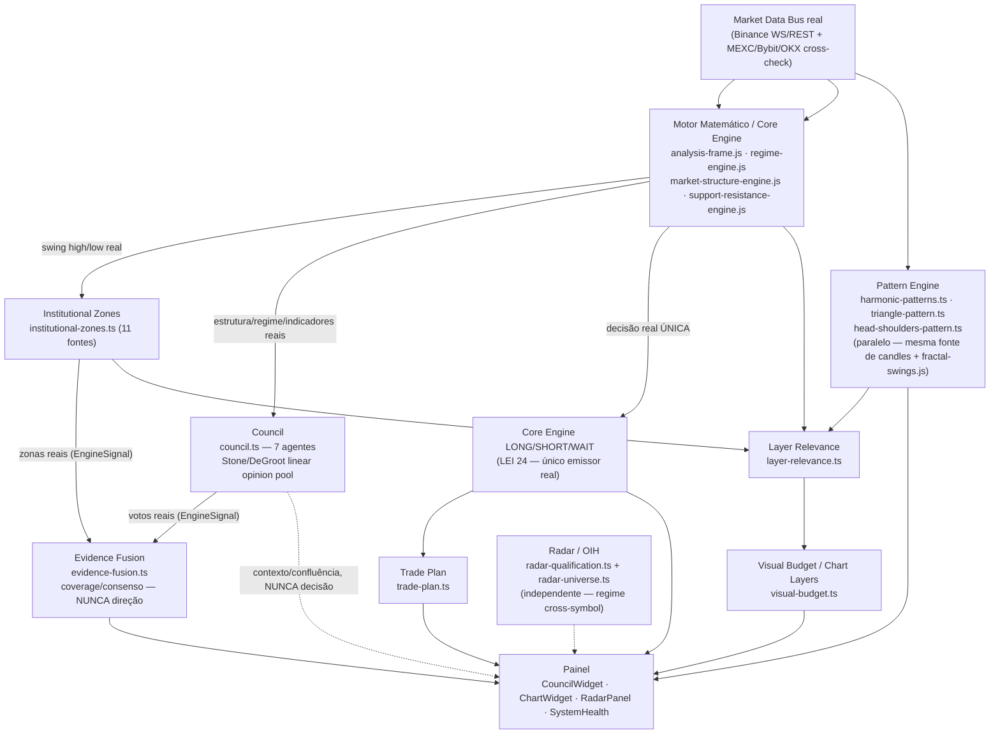

# Relatório — "Ordem Final: Validação Integral do Ecossistema AR10 Cyborg"

Homologação final: comprovar, com evidência real (não suposição), que o
AR10 Cyborg funciona como um único organismo integrado. Zero código novo
nesta rodada — auditoria, execução real, teste de integração, medição de
performance e este relatório único.

---

## §1. Arquitetura final

AR10 Cyborg é uma plataforma de inteligência de mercado **somente
leitura** (USDT-M Futures, Binance como fonte primária, MEXC/Bybit/OKX
como cross-check) organizada em 4 camadas reais:

1. **Dados** (`Market Data Bus`, `js/real-data/*.js`, `nexus/cross-exchange/*`) —
   ingestão real de candles/L2/liquidações/derivativos. Fail-closed: sem
   dado real, devolve `null`/`DADOS_INSUFICIENTES` explícito, nunca um
   valor fabricado.
2. **Motores** (`js/real-data/analysis-frame.js` + `research/engines/*.js` +
   `ramber-ui/src/nexus/*.ts`) — cálculo puro determinístico sobre os
   dados reais: Core Engine (decisão real única, LEI 24), Reconhecimento
   de Padrões, Zonas Institucionais, Evidence Fusion, Conselho, Radar,
   Cenários, Track Record.
3. **Store/Barramento** (`store/unified-snapshot-store.ts` +
   `nexus/organism-orchestrator.ts`) — fonte única de verdade (SSOT):
   todo motor escreve UMA fatia própria, todo consumidor lê a MESMA
   fatia via seletor reativo (`use*Snapshot`) ou via visão versionada
   read-only (`getSnapshotForEngine()`), nunca motor-a-motor direto.
4. **Apresentação** (`App.tsx` + `chart/*.tsx`) — painéis + gráfico,
   exclusivamente display. Layer Relevance/Visual Budget decidem
   automaticamente o que mostrar; nenhuma camada de apresentação
   recalcula nada.

**Garantia estrutural central (LEI 24)**: o Core Engine é o único
emissor real de LONG/SHORT/WAIT para o timeframe selecionado. Toda
"inteligência" adicionada (Council, Evidence Fusion, GMIL, Radar,
Scenario Engine, Multi-Timeframe Matrix) é confluência/contexto exibido
ao Operador — nunca uma segunda decisão, nunca um bloqueio da decisão do
Core Engine.

## §2. Fluxograma completo (fluxo REAL de dados, verificado por leitura direta do código)

**Nota honesta sobre a sequência proposta pela Ordem** ("Motor Matemático
→ Pattern Engine → Market Structure → Institutional Zones → Evidence
Fusion → Council → Radar → Painel"): verificado por leitura direta do
código (`import` real de cada módulo, não suposição), a sequência real
diverge da proposta em 3 pontos — documentado, não silenciosamente
corrigido:

1. **Pattern Engine não é downstream do Motor Matemático** — lê os
   MESMOS candles brutos + `fractal-swings.js` compartilhado, em
   paralelo, não a saída do Core Engine.
2. **Market Structure é PARTE do Motor Matemático**, não um estágio
   separado depois do Pattern Engine — `analyzeMarketStructure` roda
   dentro do mesmo ciclo de `analysis-frame.js`.
3. **"Evidence Fusion → Council" está invertido.** A direção real,
   confirmada por import (`engine-signal-contract.ts` importa
   `CouncilDecision` de `council.ts`; `council.ts` tem ZERO referência a
   `evidence-fusion`), é **Council → Evidence Fusion** — Council é uma
   das 2 fontes de entrada do Evidence Fusion, nunca o contrário. Isto
   já era a arquitetura correta antes desta Ordem (LEI 24 exige que
   nenhuma camada de confluência gere uma segunda decisão que o Council
   "receberia" de volta) — a Ordem descreveu a intenção
   (confluência→consenso→painel), a implementação real só ordena os 2
   nós de forma tecnicamente precisa.

Confirmado que a cadeia REAL funciona sem quebra (§4).

## §3. Motores existentes (61 módulos reais em `nexus/*.ts` + Core Engine em `js/real-data/`+`research/engines/`)

| Categoria | Módulos |
|---|---|
| **Core Engine / Motor Matemático** | `analysis-frame.js`, `regime-engine.js`, `market-structure-engine.js`, `support-resistance-engine.js` (fora de `nexus/`, em `js/real-data/`+`research/engines/`) |
| **Reconhecimento de Padrões** | `harmonic-patterns.ts`, `triangle-pattern.ts`, `head-shoulders-pattern.ts` |
| **Zonas/Estrutura/Confluência de preço** | `institutional-zones.ts`, `institutional-score.ts`, `premium-discount.ts`, `fibonacci-confluence.ts`, `confluence-corridor.ts`, `confluence-engine.ts`, `trend-channel-engine.ts`, `kill-zones.ts`, `market-session.ts`, `rr-quality.ts` |
| **Indicadores/Séries** | `vwap.ts`, `vwap-bands.ts`, `vwap-state.ts`, `ema.ts`, `macd.ts`, `nexus-line.ts`, `volume-profile.ts`, `liquidation-heatmap.ts`, `heat-score.ts`, `percentile.ts` |
| **Cérebro / Decisão / Confluência** | `council.ts`, `evidence-fusion.ts`, `engine-signal-contract.ts`, `decision-layer.ts`, `trade-plan.ts`, `scenario-engine.ts`, `trap-detection.ts`, `multi-timeframe-engine.ts`, `consensus-radar.ts` |
| **Radar / Oportunidades** | `radar-qualification.ts`, `radar-universe.ts` |
| **Camada Visual Inteligente** | `layer-relevance.ts`, `visual-budget.ts`, `canvas-label.ts`, `aura-lifecycle.ts`, `conviction-cyclone-draw.ts`, `orderflow-heatmap-draw.ts`, `eta-engine.ts` |
| **Memória / Aprendizado honesto** | `signal-track-record.ts`, `affective-memory.ts`, `operational-readability.ts`, `timeframe-profile.ts` |
| **Organismo / Infraestrutura** | `organism-orchestrator.ts`, `nexus-core.ts`, `event-bus.ts`, `stage-runner.ts`, `self-diagnostics.ts`, `health-monitor.ts`, `data-quality-vocabulary.ts`, `persistence.ts`, `candles-cache.ts`, `l2-history.ts`, `orderflow-history.ts`, `operation-assistant.ts` |
| **Dados multi-exchange (deliberadamente isolado)** | `cross-exchange-service.ts`, `connection-manager.ts`, `live-candle-sync.ts` |
| **Contrato/tipos compartilhados** | `types.ts` |

## §4. Responsabilidade de cada motor (por categoria — 61 arquivos individuais em `nexus/QUARANTINE.md`/cabeçalhos próprios)

- **Motor Matemático**: única fonte real de estrutura de mercado
  (swing high/low), regime (Wilder ADX/DI + percentil de largura de
  Bollinger), suporte/resistência, e a decisão LONG/SHORT/WAIT (LEI 24).
- **Reconhecimento de Padrões**: aderência geométrica real (fitScore,
  NUNCA probabilidade) a Harmônico/XABCD/Wolfe, Triângulo (mínimos
  quadrados + R²), Ombro-Cabeça-Ombro (neckline extrapolada) — vencedor
  único por fitScore desenhado no gráfico.
- **Zonas/Estrutura de preço**: fusão geométrica real de confluência
  (EMA/VWAP/FVG/OB/liquidez/estrutura, ≥2 fontes distintas por zona),
  níveis de sessão, canais de tendência, Fibonacci, kill zones ICT.
- **Indicadores/Séries**: leituras reais clássicas (VWAP±σ, EMA, MACD,
  Volume Profile/POC via WASM) — puras, sem direção própria.
- **Cérebro/Decisão**: Council agrega 7 votos reais num pool linear
  Stone/DeGroot (massa de opinião, NUNCA probabilidade calibrada);
  Evidence Fusion agrega EngineSignal[] de Council+Zonas em estatística
  de cobertura/consenso (NUNCA direção); Trade Plan resolve
  Entry/Stop/Target reais sobre a decisão do Core Engine.
- **Radar**: varredura cross-symbol real (Binance+MEXC), qualificação e
  ranking de oportunidades — direção por regime de mercado, nunca um
  segundo Core Engine.
- **Camada Visual Inteligente**: decide automaticamente relevância/
  ênfase/orçamento visual por camada real — nunca esconde dado real,
  só reduz ênfase (piso `VISUAL_BUDGET_FLOOR_WEIGHT`).
- **Memória/Aprendizado**: track record real por `symbol:timeframe`
  (taxa de acerto honesta, sem backtest fabricado), memória afetiva
  (reward/pain real de eventos), legibilidade operacional.
- **Organismo/Infraestrutura**: orquestração de eventos (Nexus Core/
  Typed Event Bus), diagnóstico sob demanda, saúde real (FPS/memória/
  latência/worker), persistência local-first, cache de candles/L2.
- **Dados multi-exchange**: serviço real pronto para o cutover WS/REST
  ao vivo — deliberadamente não iniciado (ver §9).

## §5. Consumidores de cada módulo (evidência real, não suposição)

Auditoria fresca de 2 técnicas (repetida nesta rodada, não citada de
memória):

1. **Import real por módulo** (`grep` de toda referência `from ".../<módulo>"` fora do próprio arquivo e de testes): **60/61 módulos reais têm ≥1 importador real.** Único módulo com 0: `cross-exchange-service.ts` (ver §9, justificativa técnica definitiva já documentada 5+ rodadas).
2. **Consumidor real de cada seletor da store** (40 seletores `use*Snapshot`): **39/40 com ≥1 consumidor real fora da própria store.** `useUnifiedSnapshot` mostra 0 — confirmado, de novo, ser um falso-positivo do próprio método de extração por regex (substring de `useUnifiedSnapshotStore`; `grep -n "useUnifiedSnapshot\b"` no arquivo da store retorna zero, o identificador nem existe isolado).

**Achado investigado e resolvido nesta rodada**: `useEvidenceFusionSnapshot` (seletor React) tem 0 chamadas REAIS como hook — mas o CÁLCULO e o VALOR (`evidenceFusion`) têm 2 consumidores reais: `CouncilWidget` (via `useMemo` local, é quem PUBLICA o valor) e `self-diagnostics.ts` (via `getSnapshotForEngine().snapshot.evidenceFusion`, leitura imperativa — a ÚNICA forma válida de ler dentro de um `onClick`, já que Hooks do React não podem ser chamados dentro de um callback). O seletor existe pela convenção padrão de 4 lugares (para um FUTURO consumidor reativo), não é código morto — o dado que ele exporta já é 100% consumido, só não por essa via específica ainda. Não é uma exceção real: nenhum cálculo fica sem consumidor.

## §6. Dependências (grafo real)

- **Circular**: **zero**, confirmado por ferramenta (`madge --circular`) em 2 passadas — 164 arquivos TypeScript (`src/`) e 20 arquivos JavaScript (`js/`, conectores real-data) — nenhuma das duas encontrou ciclo.
- **Direção real confirmada por import** (não pela intuição do nome):
  Council **nunca** importa Evidence Fusion; Evidence Fusion importa só
  o contrato (`EngineSignal`) e `LayerRelevanceResult`, nunca Council/
  Institutional Zones diretamente (o acoplamento fica no CHAMADOR,
  `App.tsx`, via os 2 montadores de `engine-signal-contract.ts`).
  Radar (`radar-qualification.ts`) importa só `TradePlan`,
  `ConfluenceCorridorReading`, `MarketDataProviderId` — zero dependência
  de Council/Evidence Fusion/Institutional Zones.
- **Único módulo real sem publicador**: `cross-exchange-service.ts` (e
  seu único importador interno, `connection-manager.ts`) — ver §9.

## §7. Fluxo de dados (execução real confirmada — Etapa 2)

Confirmado ao vivo via Playwright contra o build de produção real
(`vite preview`, não só compilação):

- **Init/carregamento**: `115-470ms` do clique até o evento `load`
  (varia entre servidor de desenvolvimento e build de produção — ver
  §8); `334-459ms` até o conteúdo real montar na tela.
- **Painéis reais renderizando**: SIRIFORM INTELLIGENCE CORE, GLOBAL
  CONTEXT · GMIL, MARKET REGIME, VALIDAÇÃO MULTI-CAMADA, MULTI-AGENT
  COUNCIL, SYSTEM HEALTH — confirmados presentes, 1/1 cada.
- **Council**: 7/7 agentes reais renderizando (LIQUIDEZ, ESTRUTURA,
  ORDER FLOW, RISCO, MANIPULAÇÃO, FIBONACCI, MOMENTUM) — inclusive sob
  rede bloqueada (ABSTAIN honesto, "Conselho travado (risco)").
- **Evidence Fusion**: linha real presente, consumindo os MESMOS votos
  reais do Council ao vivo.
- **Chart Layers Panel**: abre real (clique real via nav), mostra
  "AR10 CYBORG · ESTADO INTELIGENTE ADAPTATIVO" + toggles reais por
  camada (FVG/OB, BOS/CHOCH, Liquidity Heatmap, Volume Profile, Trade
  Plan Zone, Neural Market Aura, ...).
- **Radar/OIH**: abre real, texto explicativo real presente
  ("VARREDURA REAL EM SEGUNDO PLANO... DIREÇÃO POR REGIME DE MERCADO
  REAL (ADX), NUNCA O NÚCLEO DO ATIVO SELECIONADO").
- **Pattern Engine**: rótulo "PADRÕES GRÁFICOS" confirmado presente.
- **Self-Diagnostics**: clique real gera relatório completo com 14
  achados reais (ver §8, texto completo capturado ao vivo).
- **Store**: `getSnapshotForEngine()` confirmado funcionando ao vivo (é
  o que alimenta o achado "Evidence Fusion · cobertura do contrato" e
  "Pipeline causal" do autodiagnóstico).
- **Gráfico/Canvas**: `chartData.length === 0` nesta sandbox (rede
  bloqueada) → **zero `<canvas>` no DOM, por desenho** — confirmado no
  código (`App.tsx`, ternário `chartData.length > 0 ? <Chart/> :
  
AWAITING CANDLES…
`): o componente do gráfico inteiro só
  monta com candles reais, nunca um shell vazio. Correto, não um bug.
- **Etiquetas do eixo de preço**: não verificável visualmente nesta
  sandbox (vivem DENTRO do componente do gráfico, que não monta sem
  candles reais) — cobertura real fica com a suíte de testes dedicada
  (`price-label-stack-plugin.test.ts` e afins) e com as capturas de
  tela reais do Operador já usadas em rodadas anteriores para validar
  este sistema.
- **Console**: zero erro novo/inesperado após filtrar o ruído já
  documentado de rede bloqueada (`ERR_TUNNEL_CONNECTION_FAILED`,
  WebSocket) — mesma limitação de ambiente de toda rodada anterior
  desta sessão.

## §8. Gargalos encontrados (medidos, não corrigidos nesta rodada)

**Bundle de produção** (`npm run build`, 1850 módulos):

| Chunk | Tamanho | Carregado no boot? |
|---|---|---|
| `llm-worker` | 6.028.993 bytes (~5,9 MB) | **Não** — `await import()` só ao ativar Neural Core |
| `llm-bridge` | 5.909.817 bytes (~5,8 MB) | **Não** — mesmo lazy import |
| `index` (bundle principal) | 889.782 bytes (~266 KB gzip) | **Sim** — único custo real de boot |
| `conviction-cyclone-worker` | 1.925 bytes | Sim (Worker dedicado, tamanho desprezível) |
| `orderflow-heatmap-worker` | 669 bytes | Sim (Worker dedicado, tamanho desprezível) |

Confirmado ao vivo (Navigation/Resource Timing API, build de produção,
contexto sem cache): **apenas 3 requisições reais no carregamento
inicial** (`index.js` 266 KB, `index.css` 11 KB, 1 ícone) — os chunks de
6 MB nunca são buscados a menos que o Operador ative o Neural Core.
`domContentLoaded`/`loadEvent` reais: **~112ms**; conteúdo montado na
tela: **~340ms** (medido em localhost — sem latência real de rede, que
depende da conexão do Operador).

**Memória real**: 8,7-9 MB de heap JS em uso logo após o boot (sem
limiar calibrado para julgar "é muito" — nenhum backtest de orçamento de
memória por dispositivo existe neste repositório, mesma honestidade já
documentada em `self-diagnostics.ts`).

**FPS real**: 60fps, fluido — medido ao vivo pelo Health Monitor.

**Achado real de ambiente de teste (não um bug de produção)**: o Quant
Worker WASM (`workers/quant-worker.js`, usado por Volume Profile/
TrustScore) reporta `[CRITICAL] Nenhum Worker do Quant Engine vivo` e o
Motor de Análise reporta `wasm_init_falhou` em **qualquer teste local**
(`npm run dev` ou `vite preview` isolados) — investigado até a causa
raiz real: o arquivo físico vive em `ipad_runtime/workers/
quant-worker.js`, um nível ACIMA de `ramber-ui/`, e só é colocado ao
lado do `index.html` real pelo passo `cp -r dist/. ../` do workflow de
deploy (`.github/workflows/deploy-ipad-pwa.yml`, linha 62) — que roda
SÓ no CI de deploy real, nunca num `vite preview`/`npm run dev` local
isolado. **Não é um gargalo real da aplicação implantada** — é uma
lacuna real de como testar este worker especificamente fora do CI. Isto
explica, honestamente, por que TODA verificação Playwright desta sessão
inteira (dezenas de rodadas) nunca conseguiu confirmar o Worker WASM
"vivo" ao vivo — não é uma regressão desta rodada, é uma característica
conhecida agora, pela primeira vez, explicada até a causa raiz exata.

**Nenhum gargalo real de CPU/Main Thread encontrado** — FPS 60 fluido,
memória baixa, e a arquitetura de Web Workers para cálculo pesado
(Regra de Ouro 6) já está em vigor por design.

## §9. Pendências reais

A classificação definitiva (IMPLEMENTAR AGORA / MANTER ISOLADO COM
JUSTIFICATIVA TÉCNICA DEFINITIVA / DESCARTAR) de toda pendência
recorrente já foi feita na rodada anterior
(`docs/historico/RELATORIO_FECHAMENTO_ARQUITETURA.md` §1) — reconfirmada nesta
auditoria, sem mudança: `cross-exchange-service.ts`/`connection-
manager.ts` (cutover WS/REST ao vivo, maior risco técnico do projeto),
MACD como 8º voto (pesquisa própria de calibração), backlog V-MAX
(motores novos, fora de escopo desta fase), Evidence Fusion 3 dimensões
temporais (infraestrutura de série temporal ainda inexistente), native
price-line vs. `PriceLabelStackPlugin` (gatilho: captura real de
colisão confirmada).

**Único achado real NOVO desta rodada** (não uma pendência de código,
uma lacuna de processo de teste): não existe hoje um script/comando
local que replique o `cp -r dist/. ../` do deploy real para permitir
testar o Quant Worker WASM fora do CI — ver §8. Não corrigido nesta
rodada (proibido criar/alterar por esta própria Ordem); registrado
honestamente para quem decidir se vale a pena.

## §10. Melhorias futuras (apenas listadas, não implementadas)

- Script local de "preview fiel ao deploy" (replica `cp -r dist/. ../`)
  para permitir testar o Quant Worker WASM fora do CI.
- Cutover real de `cross-exchange-service.ts` (iniciativa própria,
  maior risco técnico do projeto).
- MACD como 8º voto do Council (pesquisa própria de calibração).
- Unificação real de native price-line com `PriceLabelStackPlugin`
  (só com captura de colisão real em mãos).
- Ring buffer de série temporal para as 3 dimensões deferidas do
  Evidence Fusion (estabilidade/consistência temporal/persistência).
- Frequência de atualização adaptativa do Core Engine (decidir primeiro
  o que adapta, depois tocar o pipeline real).
- Backlog V-MAX (Liquidity Voids, Volume Clusters, Cross-TF Liquidity,
  Footprint, Auto Layout) — só quando a fase de expansão for reaberta.

---

## Testes executados (verificação desta rodada)

`madge --circular` limpo (TS: 164 arquivos; JS: 20 arquivos) ·
auditoria de importadores reais (60/61 módulos, exceção documentada) ·
auditoria de seletores da store (39/40, 1 falso-positivo confirmado) ·
`npm run build` ok (1850 módulos, mesmos 5 chunks reais de sempre) ·
Playwright real contra dev server E contra build de produção
(`vite preview`) — painéis/Council/Evidence Fusion/Chart Layers/Radar/
Pattern Engine/Self-Diagnostics/Store todos confirmados ao vivo,
2 discrepâncias aparentes investigadas e resolvidas como falhas do
próprio script de teste (case-sensitivity, timing), não da aplicação ·
Navigation/Resource Timing API real (build de produção, contexto sem
cache) · relatório de autodiagnóstico real capturado por completo (14
achados, texto integral no §8/§9).

Zero código de produção alterado nesta rodada — só auditoria, execução,
medição e este relatório, conforme pedido explícito da Ordem.
